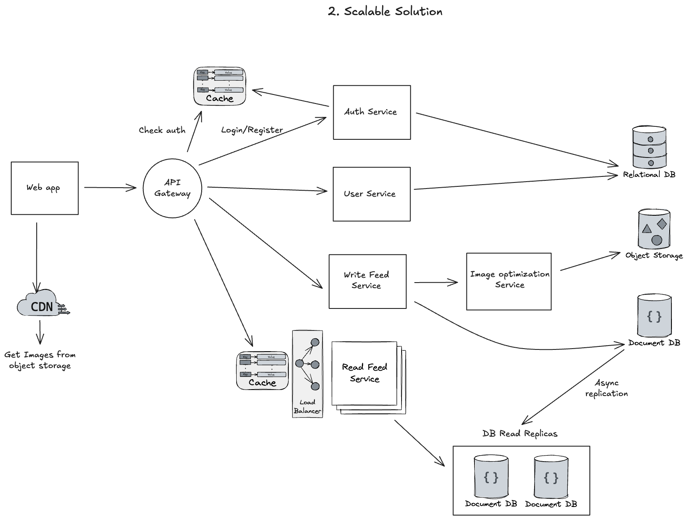

# DevConnect

This project was created to practice some concepts and skills, like:

- Solution refinement and architecture
- Using SQL and NoSQL databases
- Docker
- REST API
- GraphQL API
- Authentication (JWT + Google OAuth)
- Error Handling
- Event Emitters / Event Driven Architecture
- Clean Architecture
- Testing
- Data validation

In the future, maybe I will include some more things, like:

- WebSockets
- Message Queue
- Caching

## The domain

**"DevConnect - A Connection Platform for Developers"**

The idea is to create a social network/platform focused on developers, where they can showcase their projects, look for mentors, offer mentoring and participate in technical discussions.

### Breaking down the problem

### Code Architecture Overview

### Solution Architecture

1. At the beginning lets create a simple monolith
2. Separate and scale
3. Deep dive into actions, implementation details and storage strategies

#### Monolith Solution

#### Scalable Solution

#### Deep dive and examples

TODO: Improve this.

